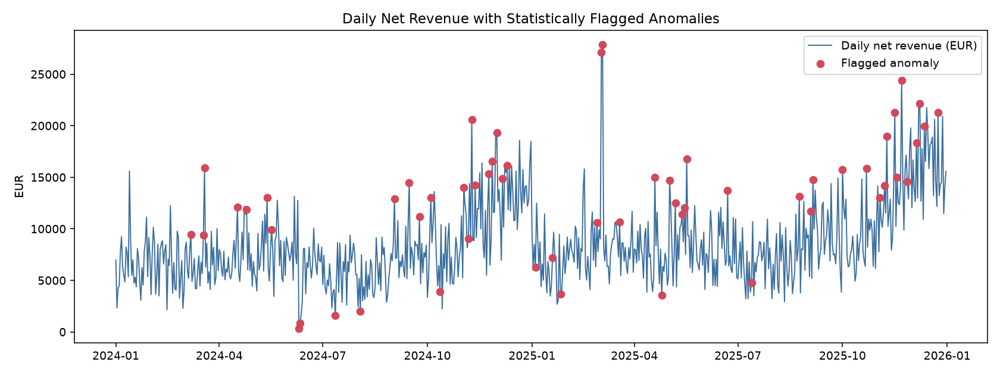

# European E-Commerce Intelligence & Customer Analytics Platform

[](https://github.com/suhaskosari/euro-ecommerce-analytics/actions/workflows/ci.yml)
**[Live dashboard](https://suhaskosari.github.io/euro-ecommerce-analytics/)** | [Anomaly evaluation](outputs/anomaly_eval.md) | [AI groundedness evaluation](outputs/groundedness_eval.md)

An end-to-end analytics platform for a multi-country European e-commerce retailer: a Python/SQL data pipeline, a dbt dimensional model, statistical anomaly detection and customer segmentation, an AI-assisted insights layer, and Power BI dashboards on top.

Built as a portfolio project on realistic **synthetic** data (no proprietary/real customer data is used) covering 7 European markets, 2 years of orders, returns, and marketing spend -- deliberately generated with the kind of messiness (duplicate rows, mixed date formats, missing values, sign errors) a real source-system export has, so the cleaning and testing layers have real work to do.

See [docs/architecture.md](docs/architecture.md) for the full pipeline diagram and design rationale, and [docs/sample_insights.md](docs/sample_insights.md) for a generated output example.

## Skills demonstrated

`SQL` `Python` `Pandas` `NumPy` `Excel` `Power BI` `DAX` `Power Query` `PostgreSQL` `Statistics` `Data Cleaning` `Data Modelling` `ETL/ELT` `dbt` `REST APIs` `Customer Analytics` `Marketing Analytics` `KPI Analysis` `AI-Assisted Analytics` `Git/GitHub`

## What it does

- **Ingests** multi-country customer, order, product, payment, marketing-spend, returns, and live ECB exchange-rate data (7 countries, ~21.5k orders, ~4k customers, 2024-2025).
- **Cleans** it with pandas: deduplication, mixed-date-format parsing, casing/whitespace normalization, missing-value imputation, sign-error correction -- every fix is logged to [outputs/data_quality_report.md](outputs/data_quality_report.md).
- **Models** it as a tested star schema in dbt (DuckDB locally; [sql/schema.sql](sql/schema.sql) documents the same shapes as PostgreSQL DDL for production), with 23 passing dbt tests (uniqueness, null checks, referential integrity).
- **Analyzes** it statistically: day-of-week-adjusted z-score anomaly detection on daily revenue, RFM customer segmentation, and a marketing-spend efficiency scan.
- **Explains** it with an AI-assisted layer that turns the validated metrics into a narrative report -- grounded so it can only cite numbers that were actually computed, never invent them (works fully offline in rule-based mode; optionally Claude-enhanced if `ANTHROPIC_API_KEY` is set).
- **Evaluates itself**: the anomaly detector is scored against the injected incidents (precision/recall with a threshold sweep, [outputs/anomaly_eval.md](outputs/anomaly_eval.md)), and the AI narrative is scored for numeric groundedness with a red-team of the checker ([outputs/groundedness_eval.md](outputs/groundedness_eval.md)).
- **Runs in CI and Docker**: GitHub Actions rebuilds the whole pipeline, runs `dbt test` and `pytest` on every push; `docker build` gives the same reproducible run.
- **Visualizes** it in Power BI: a documented data model, DAX measure library, and ready-to-import CSV exports (see [powerbi/](powerbi/)).

## Repository structure

```
euro-ecommerce-analytics/
├── python/
│   ├── generate_data.py          # synthetic multi-country e-commerce data generator
│   ├── fetch_exchange_rates.py   # live ECB rates via the Frankfurter REST API (synthetic fallback)
│   ├── etl_clean_transform.py    # pandas cleaning: dedupe, dates, casing, imputation
│   ├── load_warehouse.py         # loads clean CSVs into DuckDB (raw schema)
│   ├── stats_anomaly_detection.py# seasonal z-score anomalies, RFM segmentation
│   ├── ai_insights.py            # evidence-grounded narrative report (rule-based / Claude)
│   └── export_for_powerbi.py     # exports final marts to powerbi/exports/
├── sql/
│   └── schema.sql                # PostgreSQL-compatible dimensional warehouse DDL
├── dbt/euro_ecom/
│   ├── models/staging/           # typed passthroughs from raw sources
│   ├── models/marts/             # dim_*, fct_* dimensional model
│   └── models/marts/analytics/   # customer_ltv, cohort_retention, monthly_revenue_kpis,
│                                  #   product_performance, marketing_roi, returns_analysis
├── powerbi/
│   ├── data_model.md             # relationships, star schema diagram, Power Query example
│   ├── DAX_measures.md           # full DAX measure library
│   └── exports/                  # CSVs ready for Power BI import
├── docs/
│   ├── architecture.md           # pipeline diagram + design rationale
│   └── sample_insights.md        # generated AI-insights report (example output)
├── outputs/                      # anomaly/RFM CSVs, revenue chart, data-quality report
└── data/raw/                     # generated synthetic source-system exports
```

## Quickstart

Requires Python 3.11+.

```bash
python -m venv .venv
.venv/Scripts/activate        # Windows; use `source .venv/bin/activate` on macOS/Linux
pip install -r requirements.txt
```

Run the full pipeline end to end:

```bash
python python/generate_data.py
python python/fetch_exchange_rates.py
python python/etl_clean_transform.py
python python/load_warehouse.py

cp dbt/profiles.yml.example dbt/profiles.yml
DBT_PROFILES_DIR=dbt dbt seed --project-dir dbt/euro_ecom
DBT_PROFILES_DIR=dbt dbt run  --project-dir dbt/euro_ecom
DBT_PROFILES_DIR=dbt dbt test --project-dir dbt/euro_ecom

python python/stats_anomaly_detection.py
python python/ai_insights.py            # add --llm with ANTHROPIC_API_KEY set for Claude-phrased prose
python python/export_for_powerbi.py
python python/eval_groundedness.py      # add --llm to also score a Claude-phrased report
python python/eval_anomaly_detection.py
python python/build_dashboard.py        # regenerates docs/index.html from the outputs
```

All commands are run from the repo root (dbt-duckdb resolves the warehouse path relative to your working directory -- see the note in `dbt/profiles.yml.example` if you relocate things).

Then open Power BI Desktop and follow [powerbi/data_model.md](powerbi/data_model.md) to import `powerbi/exports/*.csv` and build the relationships/measures.

## Example output

Daily net revenue with statistically flagged anomalies (`outputs/revenue_anomalies.png`), generated by `stats_anomaly_detection.py`:



Three incidents are deliberately injected into the synthetic data generator: a 3-day checkout outage (June 2024), a 2-day flash-sale spike (March 2025), and a paid-search overspend period (January 2025). Because they are injected, detectors can be scored against ground truth rather than judged by eye:

| Detector (revenue incidents, 5 true days of 731) | Days flagged | Precision | Recall |
|---|---:|---:|---:|
| Weekday-median baseline on revenue, z > 2.5 | 57 | 7.0% | 80.0% |
| STL + Poisson residual on order counts, abs(z) > 3.5 | 10 | 50.0% | 100.0% |

The first detector finds the incidents but buries them in false alarms (it mistakes the Nov/Dec seasonal peak for anomalies); the second models seasonality and the Poisson noise of order arrivals. Only 5 true anomalous days exist, so treat these as relative comparisons, not production accuracy -- the caveats and a full threshold sweep are in [outputs/anomaly_eval.md](outputs/anomaly_eval.md). See [docs/architecture.md](docs/architecture.md#data-quality-issues-deliberately-injected-and-how-theyre-caught) for the full list and [docs/sample_insights.md](docs/sample_insights.md) for the AI-generated narrative built on top of these metrics.

## Data provenance

Everything is synthetic except the exchange rates: customers, orders, items, payments, returns and marketing spend come from a seeded generator (`python/generate_data.py`) with deliberately injected defects and incidents, and the ECB daily rates come from the live Frankfurter API. No real customer or company data is used. The consequence worth stating plainly: headline metrics (revenue, segment sizes, detection scores) describe the generator, not a real business -- the project demonstrates the engineering and analytical method, not discoveries about a market. Note that Faker-generated names can differ across library versions, so regenerating can change customer-level rows (and therefore RFM segment counts slightly) while revenue totals and incident dates stay fixed.

## Testing and CI

```bash
pytest -q          # groundedness-checker unit tests + warehouse integrity checks
docker build -t euro-ecom . && docker run --rm euro-ecom   # full pipeline in a container
```

## Design notes

- **Why DuckDB locally / PostgreSQL in `sql/schema.sql`**: the dimensional model is documented as production-ready Postgres DDL, but the demo runs on DuckDB so anyone cloning the repo can execute the entire pipeline with zero infrastructure -- no database server to provision.
- **Why the AI layer is evidence-grounded, not free-form**: `ai_insights.py` computes every number with pandas/dbt first, then either templates it directly or asks an LLM to *phrase* (never originate) those exact figures. This is deliberate -- it is the difference between an AI layer you can trust in a business report and one you can't.
- **Marketing ROI is blended, not attributed**: `marketing_roi` joins spend to revenue at the country-month grain because the dataset has no click-to-order tracking; it's explicitly documented as "blended ROAS," not multi-touch attribution, to avoid overstating what the data can support.

## License

MIT -- see [LICENSE](LICENSE).
