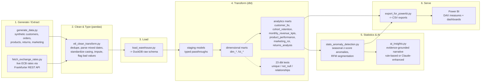

# Architecture

## Pipeline overview

## Why this shape

- **ELT, not ETL**: raw data is loaded into DuckDB largely as-is after a *light* Python cleaning pass (fixing genuine data-quality defects: duplicates, mixed date formats, bad casing, sign errors), and the *business* transformation (star schema, KPIs, segmentation logic) lives in dbt SQL, version-controlled and tested. This mirrors how a production warehouse (Snowflake/BigQuery/Postgres + dbt) is typically organized, just swapping in DuckDB so the whole thing runs locally with zero infrastructure.
- **DuckDB locally, PostgreSQL-shaped in `sql/schema.sql`**: the dimensional model is documented as standard Postgres DDL for a production deployment; DuckDB is used here purely so the repo is runnable by anyone who clones it, with no database server to stand up.
- **Statistics before AI**: anomaly detection and RFM segmentation are done with pandas/numpy/scipy against the dbt marts -- these are the "evidence." The AI layer is only ever asked to phrase evidence that's already been computed, never to originate a number. This is the same grounding pattern used in production LLM analytics tools, and it's what makes the AI layer safe to trust: the burden of correctness is on the deterministic statistics, not the model.
- **Reproducible by construction**: `generate_data.py` and the RFM/z-score logic are seeded/deterministic, so re-running the whole pipeline from scratch always reproduces the same numbers referenced in [docs/sample_insights.md](sample_insights.md).

## Data quality issues deliberately injected (and how they're caught)

| Issue | Where it's introduced | Where it's caught/fixed |
|---|---|---|
| Duplicate customer/order rows (simulated re-run export) | `generate_data.py` | `etl_clean_transform.py` dedupes on primary key, logged in `outputs/data_quality_report.md` |
| Mixed date formats (`YYYY-MM-DD` vs `DD/MM/YYYY`) | `generate_data.py` | `etl_clean_transform.py::parse_mixed_date` |
| Inconsistent casing/whitespace in country codes & categories | `generate_data.py` | `etl_clean_transform.py` standardization + category lookup |
| Missing product cost | `generate_data.py` | imputed via median cost-to-price ratio per category |
| Negative order amounts (sign errors) | `generate_data.py` | corrected + flagged via `data_quality_flag` column, carried through to `fct_orders` |
| Checkout outage (3 days near-zero orders, June 2024) | `generate_data.py::gen_orders_and_items` | `stats_anomaly_detection.py` seasonal z-score |
| Flash-sale demand spike (March 2025) | `generate_data.py::gen_orders_and_items` | `stats_anomaly_detection.py` seasonal z-score |
| Paid-search overspend with weak ROI (Jan 2025) | `generate_data.py::gen_marketing_spend` | `marketing_efficiency_scan` in `stats_anomaly_detection.py` |
