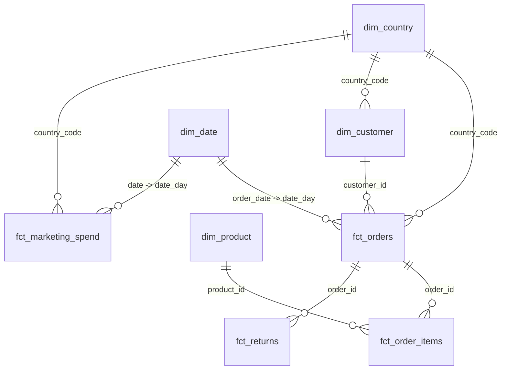

# Power BI Data Model

## Importing the data

1. Run the pipeline once (see the [root README](../README.md)) so `powerbi/exports/*.csv` is populated, or use the CSVs already committed in this repo.
2. In Power BI Desktop: **Get Data -> Text/CSV**, import every file in `powerbi/exports/`.
3. Set data types on import: `*_date` / `date` / `date_day` columns as **Date**, `*_eur` columns as **Fixed decimal number**, id columns as **Text** (so they aren't summed).
4. Mark `dim_date` as a **Date table** (Table tools -> Mark as date table -> `date_day`).
5. Build the relationships below in **Model view**.

## Star schema



| From | To | Cardinality | Cross-filter |
|---|---|---|---|
| `fct_orders[customer_id]` | `dim_customer[customer_id]` | many:1 | single |
| `fct_orders[country_code]` | `dim_country[country_code]` | many:1 | single |
| `fct_orders[order_date]` | `dim_date[date_day]` | many:1 | single |
| `fct_order_items[order_id]` | `fct_orders[order_id]` | many:1 | single |
| `fct_order_items[product_id]` | `dim_product[product_id]` | many:1 | single |
| `fct_returns[order_id]` | `fct_orders[order_id]` | many:1 | single |
| `fct_marketing_spend[country_code]` | `dim_country[country_code]` | many:1 | single |
| `fct_marketing_spend[date]` | `dim_date[date_day]` | many:1 | single |

The `monthly_revenue_kpis`, `customer_ltv`, `cohort_retention`, `product_performance`, `marketing_roi`, and `returns_analysis` tables are pre-aggregated analytics marts (already business-logic-complete from dbt) -- use them directly on report pages that don't need row-level drill-through, and keep them **disconnected** from the star schema to avoid ambiguous filter paths, or relate them read-only via the shared dimensions where drill-through is wanted (e.g. `customer_ltv[customer_id]` -> `dim_customer[customer_id]`).

## Suggested pages

1. **Executive Overview** -- `monthly_revenue_kpis`: revenue trend, MoM growth, AOV, orders, country breakdown map.
2. **Customer Analytics** -- `customer_ltv` + RFM segments (`outputs/customer_rfm_segments.csv`): lifecycle funnel, segment revenue contribution, cohort retention heatmap from `cohort_retention`.
3. **Product Performance** -- `product_performance`: category revenue/margin treemap, return-rate leaderboard.
4. **Marketing ROI** -- `marketing_roi`: spend vs. blended ROAS by channel/country, cost-per-conversion trend.
5. **Data Quality & Anomalies** -- `outputs/revenue_anomalies.csv`: flagged days overlaid on the revenue trend line (see `docs/architecture.md` for how these are computed).

## Power Query (M) example

A small example of a Power Query transformation used when pulling `fct_orders.csv` directly (rather than the already-clean export) -- demonstrates the Power Query skill alongside the Python/dbt cleaning already done upstream:

```m
let
    Source = Csv.Document(File.Contents("fct_orders.csv"), [Delimiter=",", Columns=14, Encoding=65001, QuoteStyle=QuoteStyle.None]),
    PromotedHeaders = Table.PromoteHeaders(Source, [PromoteAllScalars=true]),
    TypedColumns = Table.TransformColumnTypes(PromotedHeaders, {
        {"order_date", type date},
        {"net_amount_eur", type number},
        {"fx_rate_to_eur", type number}
    }),
    FilterCompleted = Table.SelectRows(TypedColumns, each [status] = "completed")
in
    FilterCompleted
```
